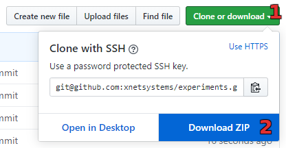
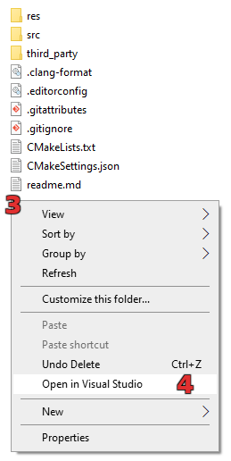
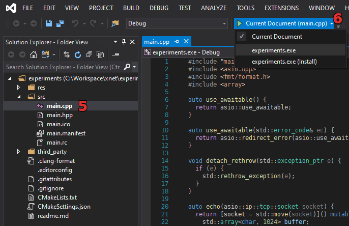

# Experiments
Example project for C++ experiments.

## Instructions
The following instructions apply for Windows with [Visual Studio 2019][vs] (any version)
with "Desktop development with C++" selected during installtion. It also works on other
operating systems - adjust as needed.

1. Click the "Clone or download" button.
2. Select "Download ZIP" or use `git` to clone the project.

3. Right-click into the project directory.
4. Select "Open in Visual Studio".

5. Open and experiment with `src/main.cpp`.
6. Select `experiments.exe` in the startup item selection drop-down menu.

7. Build and run the executable by pressing `F5` (optional).

[vs]: https://visualstudio.microsoft.com/downloads/
